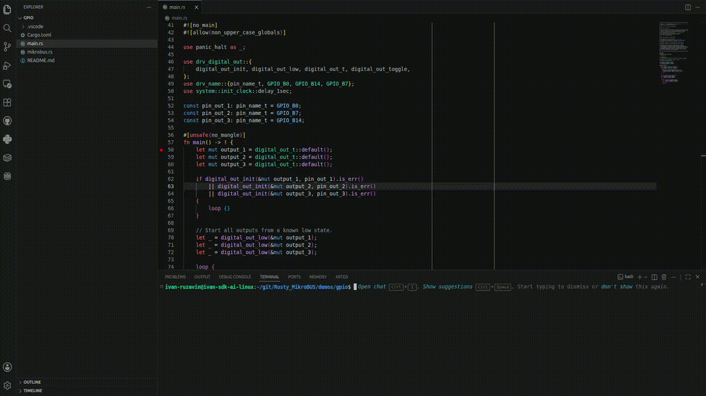
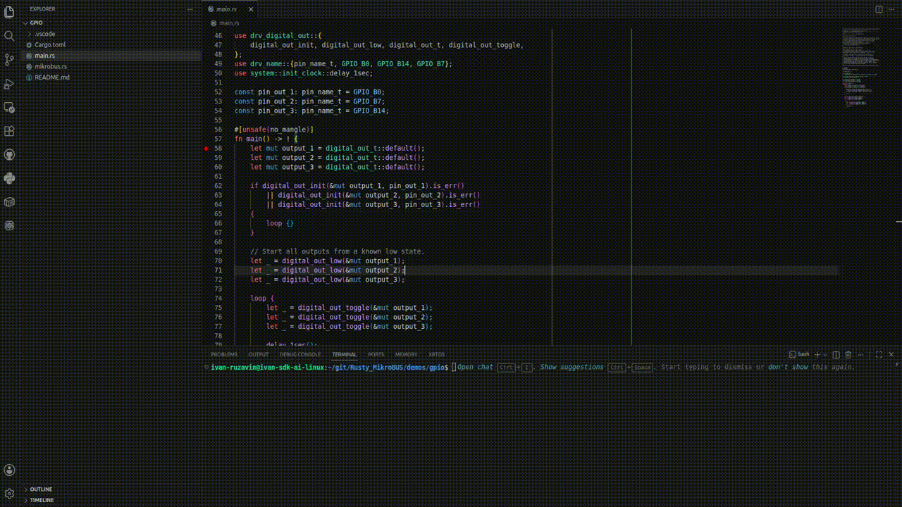

# Rusty MikroBUS

Rusty MikroBUS is an embedded Rust development environment built around mikroSDK hardware data and reusable target configurations.

The project combines a VS Code extension, a managed Rust SDK environment, board and MCU metadata, programmer integration, and project setup automation so an existing Rust application can be prepared for a supported target without carrying a full SDK copy inside every project.

## Main capabilities

- MCU and development-board configuration from a shared hardware database
- Reusable target setups with clock and target configuration
- Board, MCU-card, shield, and mikroBUS mapping support
- SEGGER J-Link programming and debugging workflow
- MIKROE CODEGRIP USB discovery, programming, erase, and GDB debugging
- Extension-managed SDK, core, database, BSP, runner, and tool packages
- Rust Analyzer project integration
- Build, flash, debug, and erase actions directly from VS Code

## How the SDK is handled

The SDK is maintained separately from user projects.

The **Development Environment** installs and updates the packages used by the extension under its managed storage location. These packages include the Rust mikroSDK sources, MCU core files, hardware database, board support data, and the development/programming tools that can be managed directly by the extension.

When a hardware setup is created, the extension builds a **reusable SDK workspace** for that setup. It starts from the managed SDK layers and prepares only the target-specific configuration needed for the selected MCU or board, including:

- compilation target configuration;
- MCU register and clock configuration;
- startup and linker files;
- MCU headers and core initialization;
- family-specific pin mappings and HAL implementations;
- board/shield information when applicable.

The resulting setup is stored centrally and can be reused by multiple projects. Updating or rebuilding a setup does not require placing the full mikroSDK source tree in the application repository.

## Applying a setup to a project

A project only needs a `Cargo.toml` in its root before a saved setup can be applied.

**Apply Setup to Project** connects the opened project to the reusable SDK configuration instead of copying the SDK into the project. The extension creates a small VS Code binding file and updates Rust Analyzer so the editor resolves the correct SDK workspace and Rust target.

Conceptually, the flow is:

```text
Managed packages
      │
      ├── database
      ├── BSP
      ├── Rust mikroSDK
      └── MCU core
      │
      ▼
Hardware Setup Configuration
      │
      ▼
Reusable target SDK workspace
      │
      ├── MCU / board configuration
      ├── clock and register values
      ├── selected programmer
      └── optional board + shield mapping
      │
      ▼
Apply Setup to Project
      │
      ├── .vscode/mikrobus-rust.json
      ├── Rust Analyzer configuration
      └── mikrobus.rs when required
      │
      ▼
Build / Program / Debug
```

For board configurations with a supported mikroBUS shield, applying the setup also generates `mikrobus.rs` next to the project application source. A board without a shield can still use the same setup flow without generating that file.

## Hardware configuration

Hardware support is driven by the project database rather than being hard-coded into the VS Code UI.

The configuration flow can represent:

- direct MCU setups;
- boards with a directly assigned MCU;
- boards that use replaceable MCU cards;
- optional compatible shields;
- supported programmer/debugger relationships.

This allows new hardware relationships to be delivered through the database and BSP packages while keeping the extension workflow consistent.

## SEGGER J-Link workflow

For a J-Link setup, the extension uses the selected target configuration with the Rust embedded tooling flow for programming, erase, and debugging.



## MIKROE CODEGRIP workflow

CODEGRIP is integrated as both a development-environment package and a programmer/debugger.

During setup configuration, the extension can start `CodegripGdbServer`, scan for connected USB CODEGRIP devices, and save the selected device information with the reusable hardware setup.

For target operations, the extension uses the CODEGRIP server and MCU packs for programming and erase. Debugging starts a CODEGRIP GDB server and attaches VS Code through Cortex-Debug, while keeping the connection and target configuration associated with the saved setup.



## Development Environment

The VS Code extension provides a single view for checking the host development environment.

Project-specific packages such as the database, BSP, Rust SDK, MCU core, CODEGRIP package, OpenOCD, and ARM GNU tools can be managed by the extension. Host-level dependencies such as Rust, probe-rs, SEGGER software, USB access rules, drivers, and build prerequisites are detected and presented with the appropriate installation path for the current platform.

This keeps setup reproducible while avoiding unnecessary system-wide assumptions for project-owned packages.

## Installing the VS Code extension

1. Download the packaged `.vsix` from the repository releases.
2. In VS Code, open **Extensions**.
3. Choose **Install from VSIX...**.
4. Reload VS Code.
5. Open the **MikroBUS Rust** Activity Bar view.
6. Open **Development Environment** and resolve the required packages and tools.
7. Create a hardware setup and apply it to a Rust project.

## Repository

The repository contains the VS Code integration and the packages used to construct the managed Rust embedded development environment.

